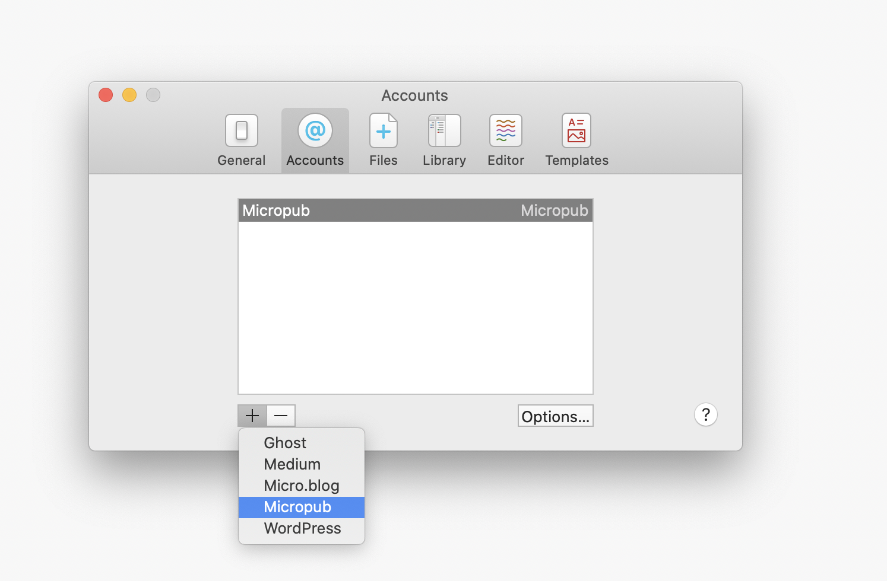
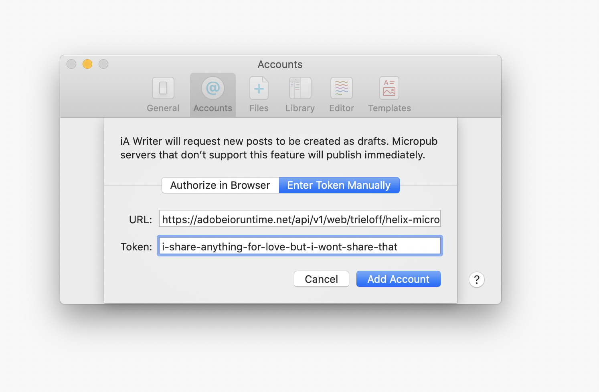
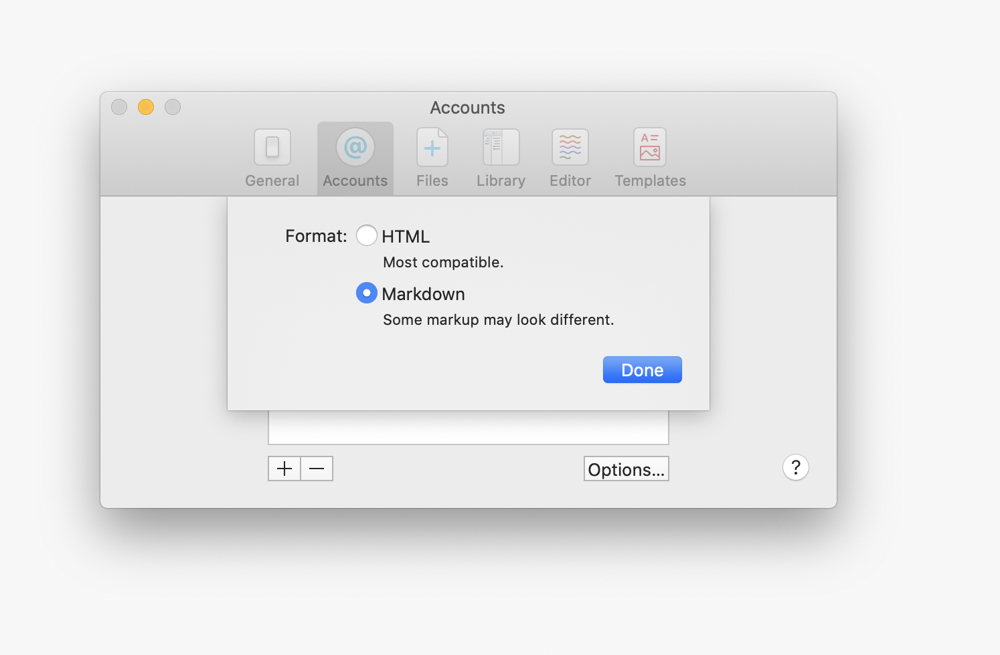

# Helix MicroPub Endpoint

> A micropub publishing endpoint for Project Helix

## Status
[](https://codecov.io/gh/trieloff/helix-micropub-endpoint)
[](https://circleci.com/gh/trieloff/helix-micropub-endpoint)
[](https://github.com/trieloff/helix-micropub-endpoint/blob/master/LICENSE.txt)
[](https://github.com/trieloff/helix-micropub-endpoint/issues)
[](https://lgtm.com/projects/g/trieloff/helix-micropub-endpoint)
[](https://github.com/semantic-release/semantic-release)

## Installation

None. This is a service.

## Demo

https://vimeo.com/424564648

## Purpose

[Micropub](https://indieweb.org/Micropub) is an API for creating posts on Websites. It is supported by a number of clients, most notably [IA Writer](https://ia.net/writer).

`helix-micropub-endpoint` is a Micropub endpoint for GitHub that works great with [Helix Pages](https://www.hlx.page). If you quickly need to post something from a desktop or mobile client without using the GitHub online editor, you might want to give it a try.

The base URL `https://adobeioruntime.net/api/v1/web/trieloff/helix-micropub/publish@v1/<owner>/<repo>/<ref>` includes your GitHub username, repository and the branch where you want posts to show up. Typically that would be `master`.


## Usage

Try the service here:

```bash
curl https://adobeioruntime.net/api/v1/web/trieloff/helix-micropub/publish@v1/<owner>/<repo>/<ref>
```

### Posting with IA Writer

1. Open IA Writer
2. Go to Settings and Accounts



3. Click the plus button and select Micropub



4. Select "Enter Token Manually"
5. Paste the URL from above.
6. Paste a GitHub developer token that has access to the `repo` and `user` scope (it will commit in your name)



7. You are ready to post.

## Development

### Deploying Helix MicroPub Endpoint

Deploying Helix MicroPub Endpoint requires the `wsk` command line client, authenticated to a namespace of your choice. For this project, I am using the `trieloff` namespace.

All commits to master that pass the testing will be deployed automatically. All commits to branches that will pass the testing will get commited as `/helix-micropub/publish@ci<num>` and tagged with the CI build number.
